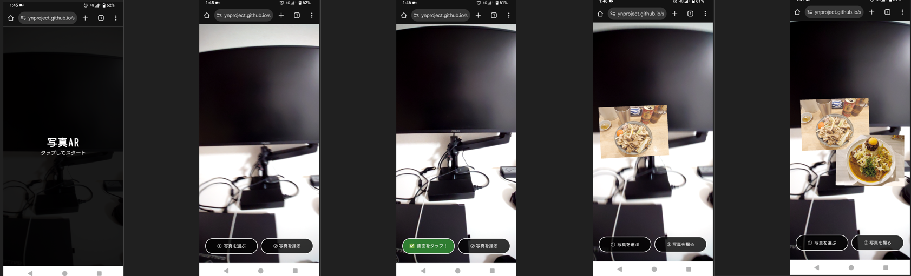

# ①写真AR写真
 

## ②説明
- 撮った写真をARとして表示してそれを写真にとれるアプリです。
- 飲食店で料理を撮って店を出たらその外観と合わせてさっきの料理の写真をARで出して、それを写真にする。というものです。

## ③アプリのデプロイURL
https://yugames.sakura.ne.jp/photo-ar/

## ④アプリのログイン用IDまたはPassword（ある場合）
なし

## ⑤工夫した点・こだわった点
- プレイ中にどんどん重くならないようにAR化する写真の画質を落とすなど、体験のしやすさに関わる調整を考えながら進めているところ、（アップロード上限はまだ入れてないです）

## ⑥難しかった点・次回トライしたいこと（又は機能）
- WebARでできることとか、制約とかを探りながら進めてます。
- 

## ⑦フリー項目（感想、シェアしたいこと等なんでも）
プレイ動画

https://github.com/user-attachments/assets/0b831aaa-db60-49d9-b06f-8bae49b6ca4c

